# Requisitos

- Intellij 2021
- Git
- Google Chrome (Versão minima 95)

### Instalando o intelliJ

Siga ao site *https://www.jetbrains.com/idea/download/#section=windows* e baixe no icone indicado.

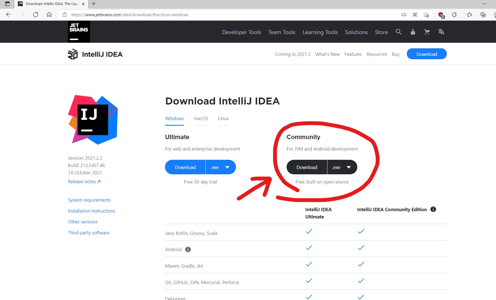

Procure onde baixou e siga as instruções de instalação.

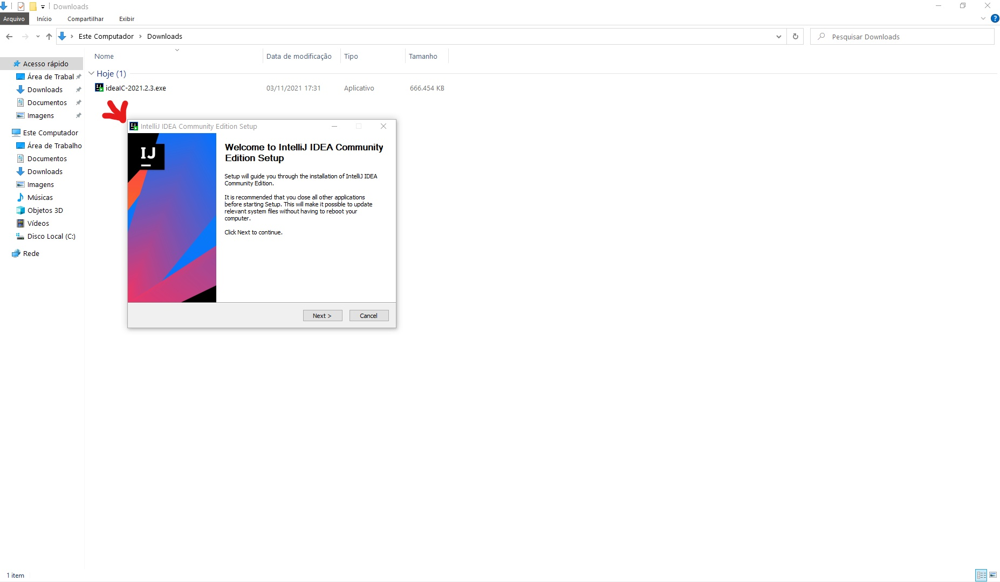

Apos o processo de instalação terminar, ele deve estar em seu menu iniciar.

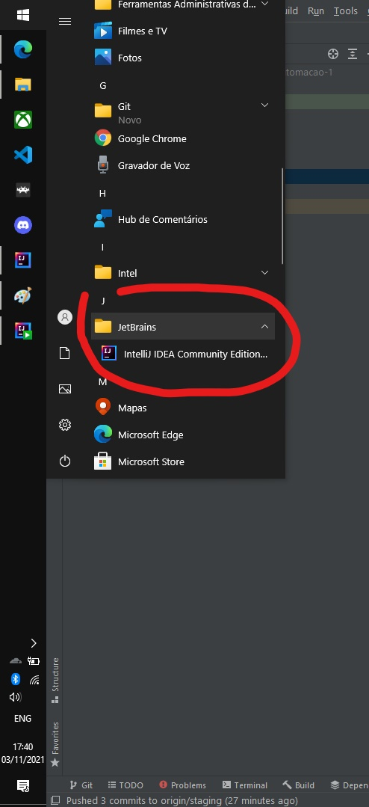

### Clonando o projeto pelo git

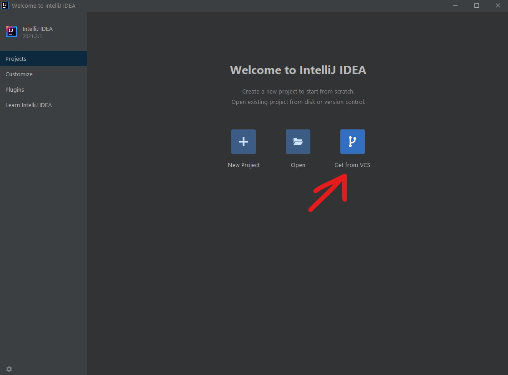

Caso nao tenha instalando o Git, a opcao sera exibida logo abaixo.

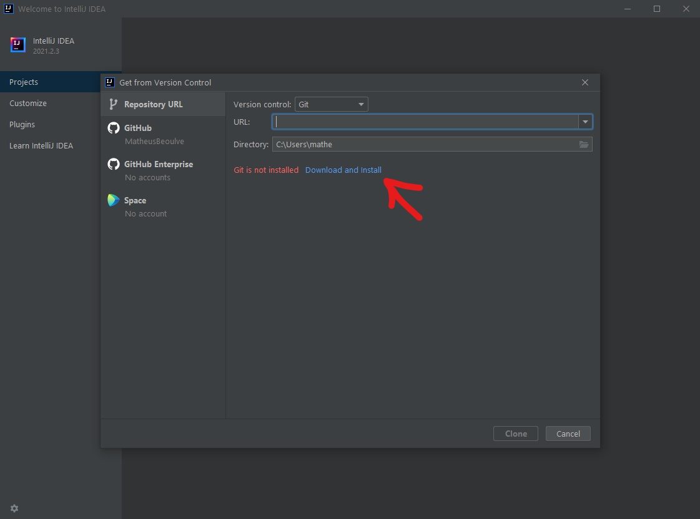

Preencha a URL com o endereço do repositório com: *https://github.com/MatheusBeoulve/aula-automacao-1.git*

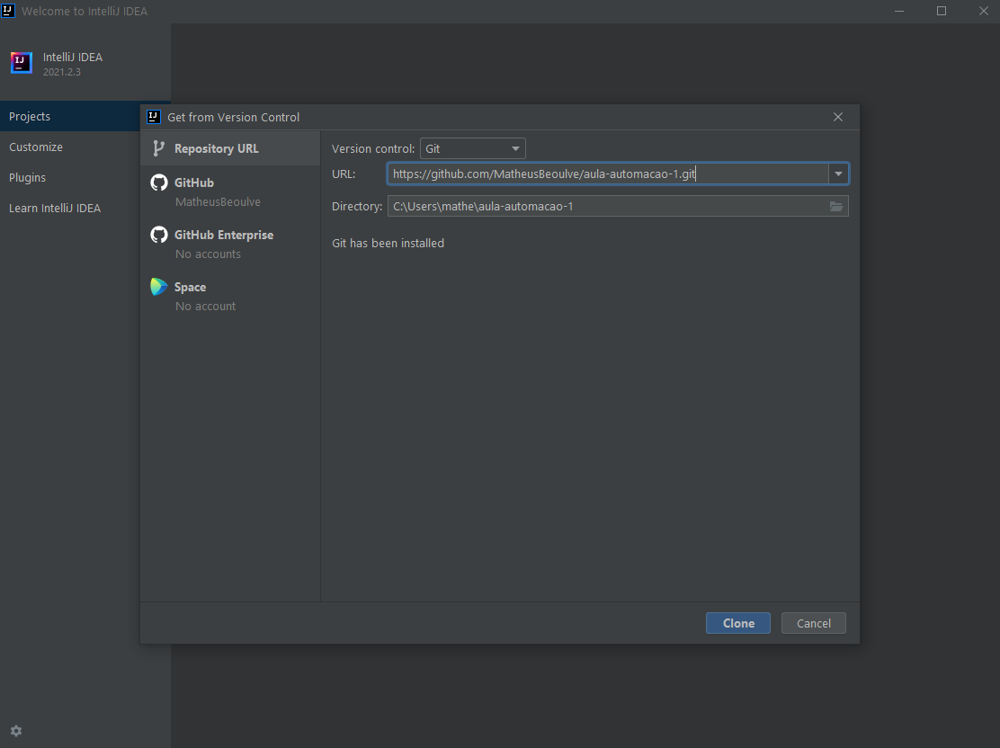

Clique em "Clone" e aguarde o projeto ser aberto.

### Executando um teste

Para verificar que toda sua instalacao foi um sucesso, va ate o arquivo em **src/test/java/io/exemplo/automacao/tests** e abra **PrimeiroWebDriverTest.java**.

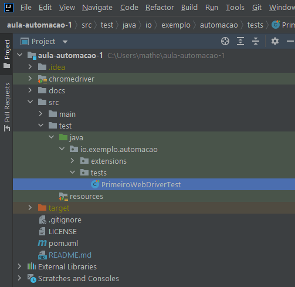

Caso nao tenha uma JDK (Java Development Kit) instalado, ele pedira para confira-lo usando essa barra azul encima do arquivo, clique nela e acesse "Download JDK" e escolha a versao 11 da Amazon.

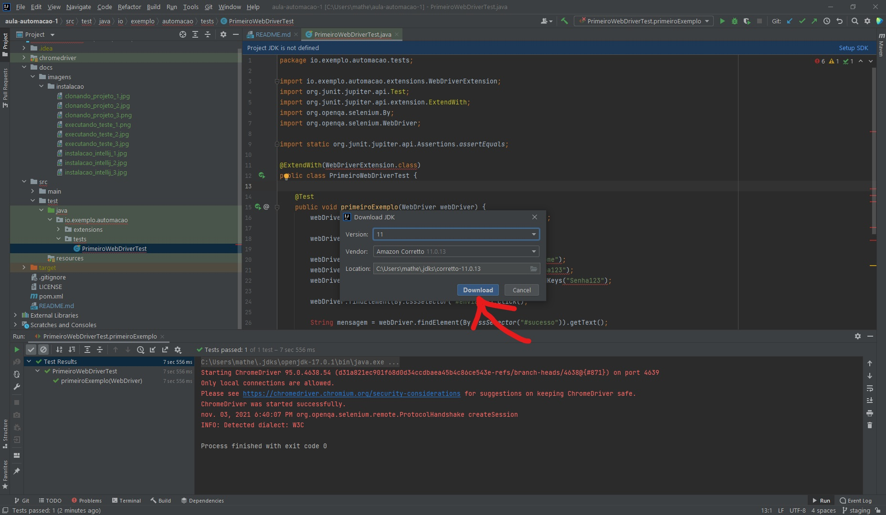

Aguarde o download da JDK e todas as dependências, isso sera demonstrado nessa barra inferior à direita. Apos o baixado recomendo reiniciar o intelliJ e aguarde novamente essa barra desaparecer. 

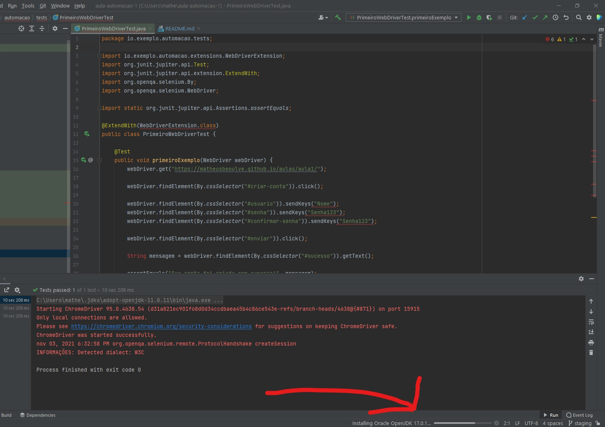

Execute o teste no icone indicado.

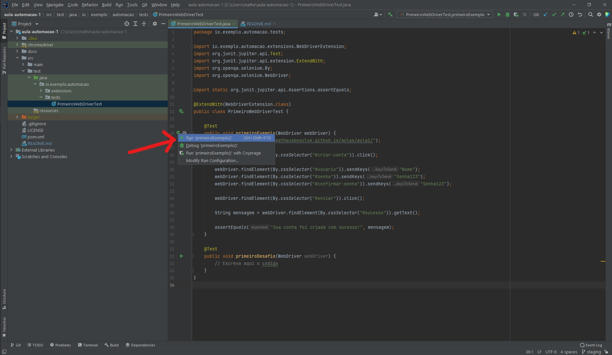

Então o teste sera executado e o resultado esperado sera:

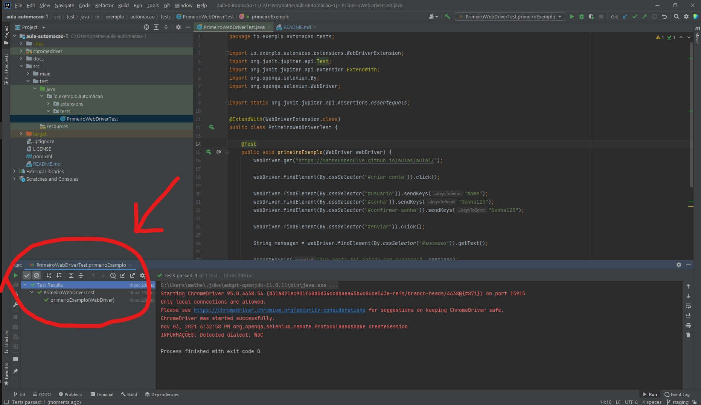

Parabens! Voce executou seu teste!
